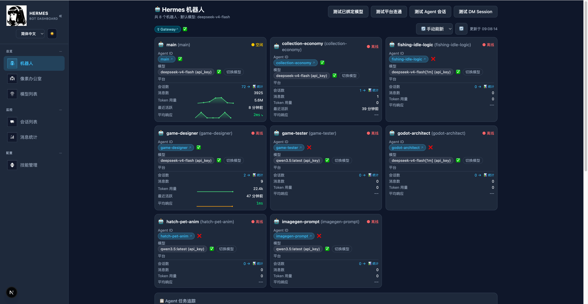

# Hermes Dashboard

A lightweight web dashboard for viewing your Hermes agents, models, sessions, skills, and gateway health in one place.

Dashboard preview:


## Features

- Agent overview cards with model/platform/session status
- Model list with capability fields and quick tests
- Session list by agent (including usage and connectivity checks)
- Stats view for response and token trends
- Skills view from local Hermes skill data
- Gateway health badge with Hermes version
- Auto refresh, i18n (中文/English), light/dark theme
- Live local data (no external database)

## Data Source

This project reads local Hermes files directly:

- `~/.hermes/config.yaml`
- `~/.hermes/profiles/*/config.yaml`
- `~/.hermes/sessions` and profile session folders

You can override the root path with `HERMES_HOME`.

## Getting Started

See [Quick Start Guide](quick_start.md) for prompt/git/skill startup options.

```bash
git clone https://github.com/xiao8cn/hermes-bot-review.git
cd hermes-bot-review

pnpm install
pnpm dev
```

Open [http://localhost:3000](http://localhost:3000).

## Requirements

- Node.js 20+
- Hermes CLI available in PATH (`hermes`)
- Hermes config and sessions under `~/.hermes` (or custom `HERMES_HOME`)

## Configuration

```bash
HERMES_HOME=/opt/hermes
pnpm dev
```

## Docker

```bash
docker build -t hermes-dashboard .
docker run -d -p 3000:3000 \
	-e HERMES_HOME=/opt/hermes \
	-v /path/to/hermes:/opt/hermes \
	hermes-dashboard
```

## Changelog

### 2026-05-14

- Refactored `/models` into a config-first model management page based on `~/.hermes/config.yaml` (`model` section).
- Added clearer provider/model/base URL summary and command guidance for Hermes model switching.
- Updated Pixel Office rendering to replace lobster visuals with pixel cats.
- Synced open-source metadata to GitHub release context (`xiao8cn/hermes-bot-review`), including author and repository links.

---

# Hermes 仪表盘（中文）

一个轻量级 Web 仪表盘，用于统一查看 Hermes 的 Agent、模型、会话、技能与 Gateway 健康状态。

## 核心能力

- Agent 总览卡片（模型、平台、会话状态）
- 模型列表与快速测试
- 按 Agent 浏览会话（含连通性与使用量信息）
- 统计页（响应/Token 趋势）
- 技能列表（读取本地 Hermes skills）
- Gateway 健康检查与 Hermes 版本展示
- 自动刷新、中英文切换、深浅色主题

## 数据来源

本项目直接读取本地 Hermes 数据，不依赖数据库：

- `~/.hermes/config.yaml`
- `~/.hermes/profiles/*/config.yaml`
- `~/.hermes/sessions` 及各 profile 的 sessions

可通过 `HERMES_HOME` 覆盖默认目录。

## 快速开始

更多启动方式见：[快速启动文档](quick_start.md)

```bash
git clone https://github.com/xiao8cn/hermes-bot-review.git
cd hermes-bot-review

pnpm install
pnpm dev
```

浏览器打开 [http://localhost:3000](http://localhost:3000)。

## 环境要求

- Node.js 20+
- 系统可直接调用 Hermes CLI（`hermes`）
- Hermes 配置与会话位于 `~/.hermes`（或你设置的 `HERMES_HOME`）

## 自定义 Hermes 路径

```bash
HERMES_HOME=/opt/hermes
pnpm dev
```

## Author

- GitHub: [xiao8cn](https://github.com/xiao8cn)
- Repository: [xiao8cn/hermes-bot-review](https://github.com/xiao8cn/hermes-bot-review)